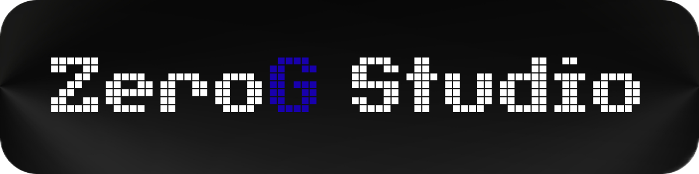

# ZeroG Studio - Discover the Fantasy of Old Games for Low-End Devices

Welcome to the official GitHub organization of **ZeroG Studio**. We are a passionate team dedicated to creating charming, non-demanding, and enjoyable games for everyone, regardless of their hardware. We believe that quality gameplay should not require the latest computing machinery.

---

## About Us

ZeroG Studio is a collective of developers, designers, and enthusiasts who share a common vision: bringing the joy of simple, engaging, and imaginative games back to the mobile and PC landscape. Our focus is on **accessibility** and **creativity**.

Our core philosophy is simple: **High-End Fun for Low-End Specs.**

* **Target Platforms:** Mobile (Android/iOS) and PC (Windows/Linux).
* **Game Style:** We develop a variety of games, including casual games, arcade experiences, and short, story-driven adventures. We aim for games that feel both nostalgic and fresh.
* **Focus:** Minimal system requirements, optimized performance, and maximum player enjoyment.

We are currently based in **Ukraine** and driven by a global community of open-source contributors and collaborators.

---

## Our Current Projects

Check out some of the repositories below to see what we are currently developing. We often keep our game code open-source to encourage community contribution and transparency.

| Repository Name | Status | Description | Link |
| :--- | :--- | :--- | :--- |
| **Forgotten Station 41** | In Development | The DOOM-style game is undemanding and can be completed in 15-20 minutes. | There is no link under development |

---

## Join the Crew (Collaboration Welcome)

Do you appreciate classic game design? Are you passionate about optimization? ZeroG Studio highly values collaboration. We are always looking for talented individuals to join our efforts:

1.  **Programmers:** If you can write clean, efficient code (C#, Python, etc.) optimized for low-specification hardware, we encourage you to apply.
2.  **Artists & Designers:** Bring your unique low-poly or pixel-art style to our projects.
3.  **Sound & Music Composers:** Create simple, high-quality soundtracks, often in a chiptune or retro style.
4.  **Game Testers & Feedback Givers:** Play our prototypes and provide valuable insights on improvement.

### How to Contribute:

* **Select a Project:** Find a project in the **[Repositories](https://github.com/orgs/ZeroG-Studio/repositories)** section that interests you.
* **Review Issues:** Look for issues labeled `good first issue`, `help wanted`, or `bug`.
* **Fork & PR:** Fork the repository, implement your changes, and submit a **Pull Request (PR)**.
* **Start a Discussion:** Feel free to open an issue to discuss a new feature or idea.

---

## Connect With Us

Stay up-to-date with our latest releases, development logs, and community news.

| Platform | Link |
| :--- | :--- |
| **ZeroG Studio GitHub Organization** | **[https://github.com/ZeroG-Studio](https://github.com/ZeroG-Studio)** |
| **Official Website** | **Coming Soon!** |

---

## License

Unless otherwise specified in a particular repository's license file, the code and assets in our public repositories are generally released under the **MIT License** (or a similar permissive open-source license). Please check the individual repository for specific details.

***Thank you for visiting ZeroG Studio. We look forward to creating fun games with you!***
